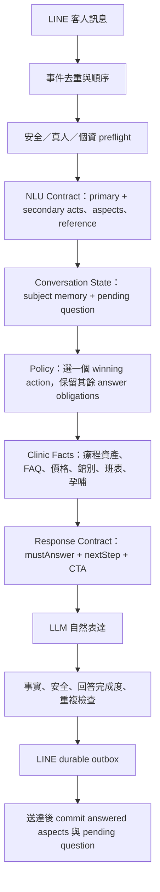

# Conversation V2 資料對齊與替換藍圖

## 一句話結論

V2 不需要推倒重寫，也不能直接把 V1 Router 搬進來。正確做法是保留 V2 的單一 action、canonical state、facts snapshot、價格／預約／真人接手邊界，補上 V1 已有但 V2 尚未建模的內容資產，再新增「對話進度」與「回答義務」。

目前的問題不是模型不夠強，而是：

1. V2 把「療程有首輪介紹」誤當成「療程所有面向都有資料可答」。
2. V2 沒保存上一輪實際問了什麼、已回答什麼、下一輪短答要接哪一題。
3. ReplyPlan 只告訴模型要做什麼，沒有可驗證的 `mustAnswer`。
4. 現有測試主要驗 policy/state，沒有從真實句子一路驗到客人可見回覆。

## 已驗證的資料現況

可用以下命令重跑盤點：

```powershell
npm run report:conversation-v2-content-parity
```

截至本文件建立時：

| 項目 | 數量 | 判讀 |
|---|---:|---|
| 院內療程 | 42 | V2 全部可辨識，且都有首輪介紹 |
| V2 treatment-level `approved` | 42 | 只代表有 intro，不代表各面向完整 |
| 有完整 consultation pack | 3 | ONDA、探索皮秒、肉毒 |
| 有困擾專屬回覆 | 3 個療程 | 其餘療程只能依 intro／一般方向回答 |
| 有舒適度／恢復期資料 | 各 3 個療程 | 客人細問時容易產生資料缺口 |
| 有品牌資料 | 3 個療程 | 品牌差異不是全館通用能力 |
| 有搭配理由 | 1 個療程 | 目前只完整支援 ONDA 的搭配脈絡 |
| 有官方來源 | 41 個療程 | 可作背景查證，不等於已有核准客服答案 |
| 有價格 reference | 2 個療程 | 價格仍以 runtime 核准 catalog 為準 |
| V1 pack 資產 | 75 筆已正規化（42 intro、7 concern、10 detail、8 quick、1 related、3 discovery、1 discovery fallback、3 feature） | 已整理成 typed assets，但尚未接入 V2 resolver |
| embedded FAQ | 1 | runtime FAQ 另有發布來源，但目前沒有進 V2 snapshot |

最重要的判讀：`approvalStatus: approved` 目前只用 intro 與 mechanism 判定。它不是「這個療程的效果、恢復期、次數、品牌、搭配與異議都能回答」的證明。

## V1 → V2 資產處置

### 保留並直接共用

- LINE webhook 驗簽、訊息送出、基本 lifecycle。
- clinic ontology、療程／困擾／部位主檔。
- 核准價格 resolver 與活動日期隱藏規則。
- 預約 lead、修改／取消、真人接手與客服工作台。
- 醫師班表服務與既有 rich message renderer。
- 安全／個資／整形外科 preflight。
- V2 exact-account canary、shadow replay 與 snapshot pinning。

### 轉成 V2 first-class data，不搬 Router 判斷

| V1 資產 | V2 目標資料 |
|---|---|
| `concernReplies` | `TreatmentReplyAsset(kind="concern")` |
| `detailReplies` | `TreatmentReplyAsset(kind="aspect")` |
| `quickReplies` | `TreatmentReplyAsset(kind="faq")` |
| `relatedReplies` | `TreatmentReplyAsset(kind="comparison" | "combination")` |
| `discoveryQuestion` | `NextStepTemplate(purpose="discover_need")` |
| `discoveryFallbackOption` | `NextStepTemplate` 的 fallback option |
| `featureSummary` | `TreatmentProfile.valueSummary` |
| `approvedCombinationTreatmentKeys` | typed `TreatmentRelationshipCatalog`；不可與話術 key 混用 |
| seed/runtime FAQ | `FaqCatalog` + `answer_faq` resolver |
| pregnancy rules | `SafetyGuidanceCatalog`，在 LLM 前 deterministic 解析 |
| promotion cards | typed `ReplyAttachment`，由 renderer 發送 |
| 競品手寫分支 | `ExternalReferenceRegistry` → 困擾與院內替代方案 |
| 交通／最近館別 | 擴充 `ClinicInfoQuery`，不做關鍵字特例 |

### 淘汰

- V1 大型 Router 內療程專名與截圖句型 `if/regex`。
- `lastIntent`、`activeFocus`、consultation state 多份互相競爭的 ownership。
- Router 直接回傳大段客服文案。
- 用字面相似度當作唯一鬼打牆判斷。
- 因 profile 某一欄缺資料，就把整輪回答降成泛用澄清。

## 目標資料模型

### 1. 面向級完整度，不再用療程級布林值

```ts
type ContentStatus =
  | "approved"
  | "official_background_allowed"
  | "human_only"
  | "unknown";

type TreatmentReplyAsset = {
  id: string;
  treatmentKey: string;
  kind: "intro" | "concern" | "aspect" | "faq" | "comparison" | "combination" | "objection";
  concernKeys: string[];
  aspectKeys: string[];
  customerCopy: string[];
  factText: string[];
  nextStep?: NextStepTemplate;
  priceRefs: string[];
  status: ContentStatus;
  version: string;
};
```

每次問題要以 `treatment × requestedAspect` 判斷可答程度。例如 ONDA intro 可答，不代表 ONDA 次數一定可答；玻尿酸品牌可答，也不代表每個品牌價格可答。

### 2. 對話進度要按 subject 隔離

```ts
type DialogueProgress = {
  customerGoal: "learn" | "compare" | "choose" | "resolve_objection" | "book";
  stage: "introduce" | "discover" | "explain" | "compare" | "invite" | "collect";
  subjectMemory: Record<string, {
    areaKeys: string[];
    concernKeys: string[];
    answeredAspects: Array<{ aspect: string; turnId: string }>;
  }>;
  pendingQuestion?: {
    id: string;
    purpose: string;
    expectedAnswerType: "area" | "concern" | "treatment" | "preference" | "booking_field";
    options?: Array<{ id: string; label: string; value: string }>;
  };
};
```

這能避免肉毒回答過 `benefits` 後，ONDA 被誤判也回答過；也能讓「脂肪」「都想看」「那價格呢」真正承接上一題。

### 3. ReplyPlan 升級為可驗證的 Response Contract

```ts
type ResponseContract = {
  primaryAction: string;
  mustAnswer: Array<{ aspect: string; subjectKeys: string[] }>;
  answerOrder: string[];
  approvedFactIds: string[];
  mustNotRepeat: Array<{ aspect: string; subjectKey: string }>;
  nextStep?: {
    kind: string;
    question: string;
    expectedAnswerType: string;
  };
  ctaPolicy: "none" | "soft_consultation" | "booking";
};
```

Renderer 不只負責「說得自然」，還必須證明：本輪明確問題已回答、沒有重問已知資訊、CTA 沒有蓋過答案。

## 目標執行流程



## Partial data 規則

資料不完整時不能整輪失去回答能力：

1. 已有核准 facts：先回答這些 facts。
2. 缺的面向：只對該面向說明需現場評估／待診所確認。
3. 有官方背景且 policy 允許：可生成一般衛教，但不得轉成院內供應、價格或保證。
4. 價格、院內有無、活動資格、預約 mutation：仍必須有診所核准資料，否則 fail closed。
5. 不得因任何單一欄位缺漏，將整輪改成「請告訴我想了解什麼」。

## 切換策略

目前 exact-account canary 一旦由 V2 `routed`，即使 V2 內部走 fallback，也不會回 V1。不能用「V2 失敗就整輪回舊 Router」補洞，否則兩套狀態會分裂。

過渡期應採能力級 fallback：

1. V2 policy 永遠擁有對話狀態與 action。
2. V2 facts resolver 先查新的 canonical assets。
3. 新資產未完成時，可經 adapter 讀取 V1 的核准內容資料；只取資料，不執行 V1 Router 決策。
4. 仍無資料時，才走受控官方背景或精準澄清。
5. V2 達標後刪除 V1 Router 與重複 state。

### Canary 觀測與事件可靠性

目前 V2 canary 對命中帳號是整段接管：V2 即使產生 `unavailable`／fallback，也不會自動回 V1。正式紀錄又缺少容易查詢的 V1/V2 route marker，因此下一輪 telemetry 至少要內部保存：

- `route_version`、`snapshot_id`、`policy_action`。
- `requested_aspects`、`must_answer`、`answered_aspects`。
- `fallback_reason`、`renderer_mode`、`generation_rejected_reason`。
- `pending_question_id` 與送達後是否已 commit。

這些欄位不得保存未遮蔽的姓名、電話或客人原文。另因現行 webhook dedupe 在 routing 後、且仍有 instance-local 邊界，100% cutover 前仍需要 durable inbox/outbox；測試帳號 canary 通過不等於事件可靠性已完成。

## 實作排程與負責模型

| 波次 | 工作 | 建議模型 | 完成條件 |
|---|---|---|---|
| P0 | 建立內容 parity report、32 組語意家族與垂直測試骨架 | TERRA 高 | 真實文字可一路跑到 customer-visible reply |
| P1 | `TreatmentReplyAsset` adapter，搬入 detail／quick／related／FAQ | TERRA 高實作；SOL 高審查 | V1 核准內容在 V2 可按 aspect 查詢，不搬 Router if |
| P2 | Dialogue Progress／subject memory／pending question | SOL 超高設計；SOL 高實作 | 短答承接、療程切換、answered aspect 隔離全綠 |
| P3 | Response Contract 與 answer-completeness guard | SOL 超高設計；SOL 高實作 | 每輪 `mustAnswer` 100%，重貼與重問為 0 |
| P4 | FAQ、孕哺、promotion、競品替代、交通等 provider parity | TERRA 高分批；SOL 高整合 | V1 商業功能 parity 零回歸 |
| P5 | durable inbox/outbox 與送達後 commit | SOL 超高裁決交易邊界；SOL 高實作 | 重送、快速連發、LINE failure 不污染 state |
| P6 | 測試帳號 50–100 turns，達標後逐步切換並刪 V1 | SOL 超高 go/no-go | 客戶品質與硬邊界門檻全達標 |

目前已完成 P0 的兩個基礎產物：

- `scripts/report-conversation-v2-content-parity.ts`：可重跑的內容完整度報表。
- `src/lib/clinic-facts/treatment-reply-assets.ts`：75 筆 V1 核准內容的 typed、唯讀 adapter。
- `scripts/fixtures/conversation-v2-customer-quality-families.ts`：32 家族／96 變體的 customer-quality contract fixture。

它們尚未接入 live routing，這是刻意的：先建立資料與驗收契約，再動 state／policy，避免再出現「資料搬了但 Router 選錯」的問題。

## 模型／智能分工

### LUNA 中

適合：

- 真實句型蒐集、去識別化、同義變體擴寫。
- 回覆文案草稿、emoji 與手機可讀性檢查。
- 已有明確 schema 的資料填寫與分類。
- 正式回覆模型候選；只能依 Response Contract 與核准 facts 表達。

不負責：狀態機、價格 ownership、安全優先序、cutover 決策。

### TERRA 中／高

適合：

- 中：機械盤點、fixture、資料 adapter、報表、格式轉換。
- 高：多檔但邊界清楚的 reducer、provider、resolver、測試 harness。
- 執行 build/check/validators 與整理差異證據。

遇到跨 state/policy/renderer 的語意衝突就升級，不自行創造產品規則。

### SOL 高

適合：

- 根因診斷、跨模組接線、Response Contract 實作。
- hydrate／renderer／facts 整合與對抗測試。
- PR 審查、故障注入、回歸判斷。

### SOL 超高

只把算力花在會改變整體語意或商業正確性的事情：

1. canonical state／schema 的新增、刪除或 ownership 變更。
2. 多意圖、否定、指代、改口與插問的裁決優先序。
3. 價格、院內供應、活動、預約、真人接手或安全邊界。
4. partial-data policy 與哪些內容可用官方背景回答。
5. V1/V2 切換、舊狀態遷移、刪除 legacy 的時機。
6. durable inbox/outbox、送達後 commit 等交易與併發設計。
7. 測試期望彼此矛盾，或診所需求與既有硬規則衝突。
8. Production incident 根因跨越三層以上，或同一問題修兩次仍復發。
9. canary go/no-go 與全量切換。

如果只是多寫資料、加同義句、搬 adapter、補 fixture 或跑驗證，不應使用 SOL 超高。

## 驗收門檻

### 進測試帳號前

- 院內供應、價格、活動日期、預約主體、安全／真人漏判：0。
- 32 組 canonical journeys 的 action/state/Response Contract：100%。
- 自然變體 NLU match：至少 95%；價格、預約、否定、reference：100%。
- 已知療程／部位／困擾重問：0。
- 完整重貼介紹：0；同一 pending question 連續重問：0。
- `mustAnswer` 客人可見完成率：100%。
- 有部分資料卻整輪無效澄清：低於 5%。
- renderer fallback：低於 10%。

### Canary 50–100 turns

- 答非所問率低於 5%。
- 無效反問率低於 5%。
- 語意重複率低於 3%。
- 價格、院內供應、活動日期與 subject ownership 錯誤：0。
- 明確預約成功進入資料收集：100%。
- 人工評分「言之有物、答有所問」至少 90%。

未達標不得把 V2 切成全量，也不得用換更大模型掩蓋狀態或資料缺口。
